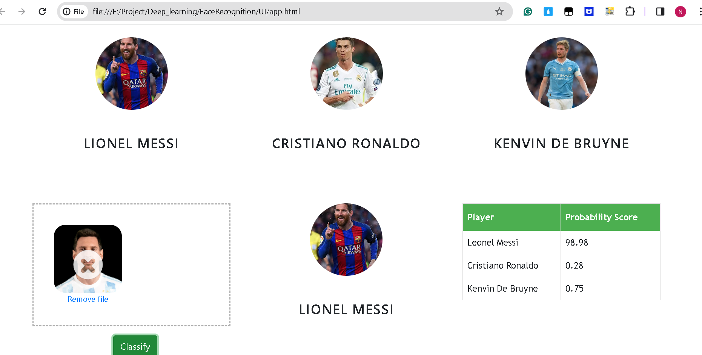

Using fatKun tool to download images from chrome

In this data science and machine learning project, we classify sports personalities. We restrict classification to only 3 people,
1) Lionel Messi
2) Cristiano Ronaldo
3) Kenvin De Bruyne

Here is the folder structure,
* UI : This contains ui website code 
* server: Python flask server
* model: Contains python notebook for model building
* DownloadImages: Dataset used for our model training

Technologies used in this project,
1. Python
2. Numpy and OpenCV for data cleaning
3. Matplotlib & Seaborn for data visualization
4. Sklearn for model building
5. Visual studio code as IDE
6. Python flask for http server
7. HTML/CSS/Javascript for UI

